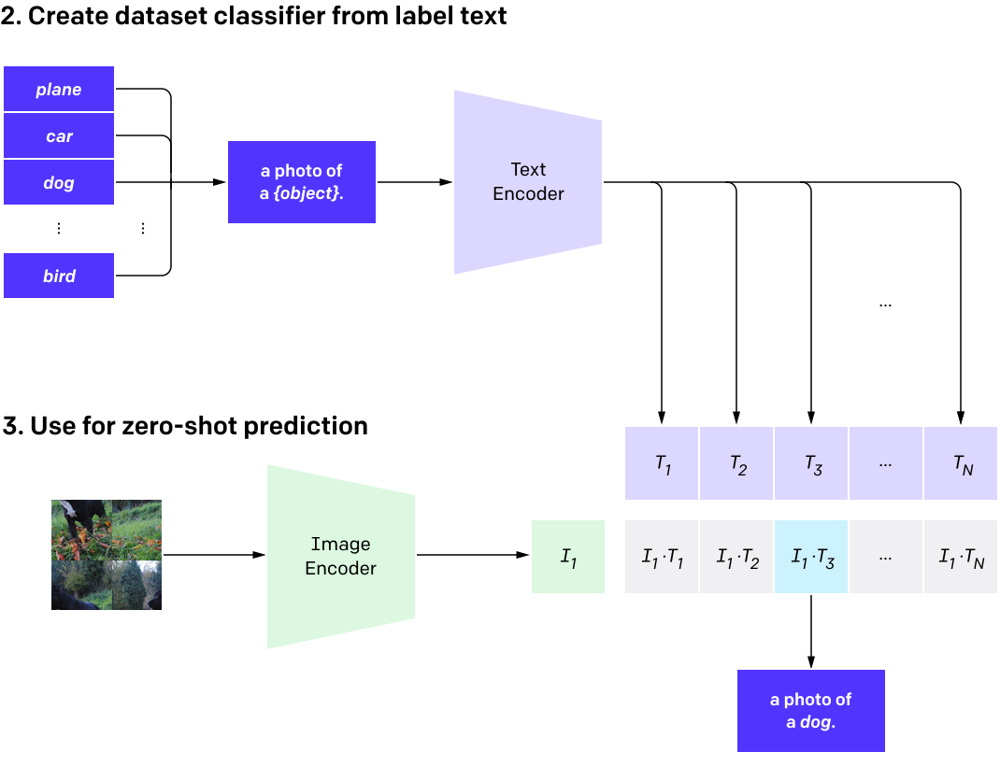

# Title
This project is ...

---

### Table of Contents
- [Prerequisites](#prerequisites)
- [Architecture](#architecture)
- [Features](#features)
- [Demo](#demo)
- [Reports](#reports)
- [Installation](#installation)
- [File Structure](#file-structure)
- [Version Control System](#version-control-system)
- [Upcoming](#upcoming)
- [Documentations](#documentations)
- [License](#license)
- [Links](#links)
- [Team](#team)
- [Contact](#contact)
- [Citation](#citation)

---

### Prerequisites
- Python 3.11
- GPU

---

### Architecture
##### Clip Architecture



---

### Features
- [x] Feature 1
- [x] Feature 2
- [x] Feature 3

---

### Demo
[Video](videoURL)
[](videoURL)


---

### Reports


---

### Installation
Do the following operations in order.

##### *for Linux/Ubuntu*
0. System Update & Upgrade
```bash
sudo apt update -y
```
```bash
sudo apt upgrade -y
```

##### 1. Create Conda Environment

````bash
conda env create -f environment.yaml -y
````

````bash
conda activate ClipFineTuning
````

##### 2. Install CUDA 12.2 for Ubuntu 22.04
```bash
wget https://developer.download.nvidia.com/compute/cuda/repos/ubuntu2204/x86_64/cuda-ubuntu2204.pin
```

---

### File Structure

```text
.
├── README.md
├── TODO.md
├── app.py
├── examples
│         ├── example_1.wav
│         ├── example_2.wav
├── flagged
├── gradio_app.py
├── outputs
│         ├── example_1.json
├── requirements.txt
└── test.py
```

---

### Version Control System
##### Releases
- [v0.1](https://github.com/organization_name/repo_name/archive/refs/tags/v0.1.zip) #.zip
- [v0.1](https://github.com/organization_name/repo_name/archive/refs/tags/v0.1.tar.gz) #.tar.gz
##### Branches
- [BranchName](https://github.com/organization_name/repo_name/tree/Stream)

##### Related Repos
- [RepoName](https://github.com/organization_name/repo_name)

---

### Upcoming
- [ ] Feature 1
- [ ] Bug Fix 1
- [ ] New Pipeline
- [ ] New Model

---

### Documentations
##### Turkish Readme
- [README_TR](.docs/README/README_TR.md)

##### TO DO
- [TODO](TODO.md)

##### Contributing Guidence
- [Contribute](CONTRIBUTE.md)

##### License
- [LICENSE](LICENSE)

##### Resources
- [Resources](RESOURCES.md)

---

### Links
- [Github](https://github.com/repo)
- [Website](https://company_name.com/en)
- [Linkedin](https://www.linkedin.com/company/company_name/)

---

### Team
- [Bunyamin Ergen](https://www.linkedin.com/in/bunyaminergen)

---

### Contact
- [Mail](mailto:info@example.com)

---

### Citation
- Reference to cite if you use Voice in a paper or research project:
``` text
@software{software_2024,
author = {Ergen},
doi = {00.0000/zenodo.0000},
month = {01},
title = {{software_2024}},
url = {https://github.com/repo_name},
year = {2024}
}
```

---
